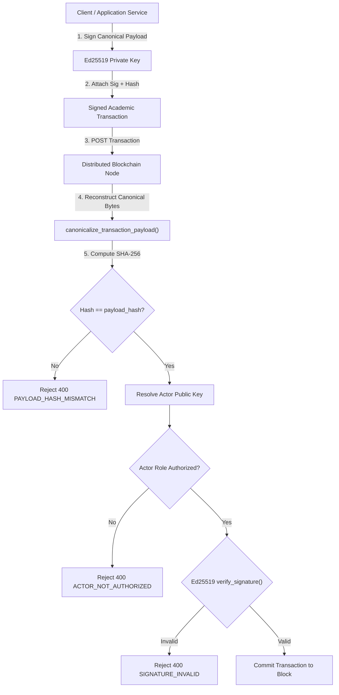

# AnswerChain Security Architecture & Cryptographic Trust (Phase 8)

## 1. Executive Summary

AnswerChain is an academic credential governance and provenance system designed to establish **cryptographically verifiable**, **tamper-evident**, and **auditable** academic records across independent institutions.

Phase 8 elevates AnswerChain from an experimental distributed prototype to an enterprise-hardened architecture with formal cryptographic trust boundaries, asymmetric digital signing of academic lifecycle transitions, peer authentication, replay protection, and verifiable document integrity.

> **Guiding Principle**: Cryptographic mechanisms do not provide legal legitimacy by themselves. They guarantee byte-level equality, strict attribution, and non-repudiation of recorded statements within a defined trust domain.

---

## 2. Threat Model & Security Objectives

| Threat Vector | Attack Scenario | AnswerChain Mitigation |
| :--- | :--- | :--- |
| **Credential Forgery** | An unauthorized entity attempts to create or register counterfeit answer scripts or marksheets. | Ed25519 digital signatures required for all critical academic actions; actor role verification against trusted authority registry; rejected at node ingress. |
| **Privilege Escalation** | A Teacher attempts to finalize examination marks or register scripts. | Server-side RBAC decorators (`@require_role`) and cryptographic invariant enforcement at node endpoints (`ACTOR_NOT_AUTHORIZED`). |
| **Unauthorized Peer Injection** | A rogue network actor sends arbitrary transactions or blocks to distributed nodes. | Node-to-node peer credential verification (`X-Node-Auth-Token`) and strict block/transaction validation. |
| **Tampered Ledger State** | A malicious insider edits historical marks directly inside database or JSON files. | SHA-256 block hash chaining; any modified block hash breaks subsequent block `previous_hash` pointers (`is_valid_chain()` returns `False`). |
| **Document Alteration** | A recipient alters marks or student details in an official PDF marksheet. | The Public Verification Engine calculates the SHA-256 hash of uploaded bytes and cross-references `MARKSHEET_REGISTERED.marksheet_pdf_hash` on the ledger (`DOCUMENT_MISMATCH` / `TAMPERED_OR_UNKNOWN`). |
| **Transaction Replay** | Submitting the same transaction multiple times to duplicate marks or registrations. | Deterministic transaction ID deduplication and lifecycle state invariant checks (409 Conflict). |
| **Token Theft & Replay** | Stolen session tokens reused after logout. | In-memory token revocation blacklist (`revoke_token`) and configurable expiration window (`TOKEN_EXPIRY_SECONDS`). |
| **Brute-Force & Denial of Service** | Flooding login or PDF upload endpoints with automated requests. | In-memory sliding-window rate limiters on `POST /api/auth/login` and `POST /api/public/verify-upload`. |

---

## 3. Cryptographic Actor Identity & Key Management

### 3.1 Cryptographic Algorithm: Ed25519 (RFC 8032)
AnswerChain uses **Ed25519** (Edwards-curve Digital Signature Algorithm over Curve25519) implemented via the vetted Python `cryptography` library (`cryptography.hazmat.primitives.asymmetric.ed25519`).
- **Key Sizes**: 32-byte public keys (64 hex characters), 32-byte private keys.
- **Signatures**: 64-byte deterministic signatures (128 hex characters).
- **Properties**: High verification speed, immunity to side-channel timing attacks, deterministic signing (no random nonce collision vulnerabilities).

### 3.2 Key Lifecycle & Storage
- **Development Key Generation**: Managed by `scripts/generate_dev_keys.py`. Keys are exported as standard PKCS#8 private PEM and SubjectPublicKeyInfo public PEM files.
- **Access Control**: Local development private keys are restricted to file mode `0600` (owner read/write only).
- **Exclusion from Git**: `.gitignore` strictly excludes `keys/`, `*.pem`, `*.key`.
- **Public Key References**: Transactions store a public key reference (`public_key_id: "ed25519:<hex_prefix>"`) rather than embedding raw private keys. Private keys never enter the blockchain or public responses.

---

## 4. Canonical Transaction Signing & Verification

### 4.1 Deterministic Payload Serialization
To guarantee that the exact same payload generates the exact same signature regardless of JSON encoder whitespace or key order, AnswerChain implements `canonicalize_transaction_payload()`:
1. Filters out transport and envelope fields (`signature`, `payload_hash`, `timestamp`, `transaction_id`, `block_number`, `block_index`).
2. Excludes server-derived runtime attributes (`public_key_id`, `status`, `evaluation_id`, `result_id`, `marksheet_id`, `pdf_path`, `pdf_filename`, `final_marks`, `marksheet_data_hash`, `marksheet_pdf_hash`, `percentage`).
3. Serializes strictly using `json.dumps(obj, sort_keys=True, separators=(",", ":"), ensure_ascii=False)`.
4. Computes `payload_hash = SHA256(canonical_bytes)`.
5. Signs `canonical_bytes` with Ed25519 private key.

### 4.2 Signature Verification Flow

---

## 5. Academic Lifecycle Invariants

The distributed node enforces state transition dependencies before accepting transactions:
1. **Assignment Invariant**: `ANSWER_SCRIPT_REGISTERED` must exist on-chain before `ANSWER_SCRIPT_ASSIGNED`.
2. **Evaluation Invariant**: `ANSWER_SCRIPT_ASSIGNED` must exist and match `teacher_id` before `EVALUATION_SUBMITTED`.
3. **Finalization Invariant**: `EVALUATION_SUBMITTED` must exist before `RESULT_FINALIZED`.
4. **Marksheet Invariant**: `RESULT_FINALIZED` must exist with status `FINALIZED` before `MARKSHEET_REGISTERED`.
5. **Immutability Invariant**: Once `RESULT_FINALIZED` is committed, teachers cannot modify marks (`POST /evaluations/submit` returns `409 Conflict`).

---

## 6. Document Integrity & Verification

### 6.1 Logical vs. Byte-Level Verification
AnswerChain separates logical data verification from physical document integrity:
- **Logical Data Hash**: `marksheet_data_hash = SHA256(canonical_json(marksheet_record))`.
- **Physical Document Hash**: `marksheet_pdf_hash = SHA256(raw_pdf_bytes)` computed only after the PDF is rendered to disk.

### 6.2 Public Upload Verification
- Uploaded PDF bytes are parsed in memory without permanent persistence to disk.
- Directly hashed with SHA-256 and matched against `MARKSHEET_REGISTERED.marksheet_pdf_hash`.
- Valid matching document returns: `"status": "VERIFIED"`, `"document_status": "DOCUMENT_MATCH"`.
- Altered or unknown document returns: `"status": "TAMPERED_OR_UNKNOWN"`, `"document_status": "DOCUMENT_MISMATCH"`.

### 6.3 Secure Document Storage Abstraction
Document storage is decoupled from application logic via `backend/document_storage.py` (`DocumentStorage` abstract base class and `LocalDocumentStorage` implementation):
- Enforces strict path traversal sanitization (rejects `..`, leading `/` or `\\`).
- Performs atomic writes via `.tmp` staging files.
- Modular interface (`save_document`, `get_document`, `delete_document`, `exists`, `get_document_path`) prepared for future cloud/object storage backends (AWS S3, Google Cloud Storage, HashiCorp Vault).

---

## 7. Node-to-Node Security & Consensus Synchronization

### 7.1 Peer Authentication
Nodes communicate over HTTP with mutual authentication headers:
- Header: `X-Node-Auth-Token: <NODE_AUTH_TOKEN>`.
- Incoming block and transaction routes reject requests with invalid credentials (`403 INVALID_PEER_CREDENTIAL`).
- Environment configuration: `NODE_AUTH_TOKEN`, `TLS_ENABLED`, `TLS_VERIFY`, `NODE_HOST`, `NODE_PORT`.

### 7.2 Fault Tolerance & Recovery
- When an individual node fails (e.g., `node-2` goes offline), the remaining nodes (`node-1` and `node-3`) continue accepting transactions and creating blocks.
- When `node-2` recovers, it connects to peer nodes, invokes `/consensus`, downloads the longest valid chain, verifies block hashes, genesis compatibility, and digital signatures, and synchronizes to identical height and latest hash.
- **Consensus Guarantee**: Longest valid chain rule with deterministic genesis block.

---

## 8. Application Security Hardening

### 8.1 Authentication & Session Security
- **Password Storage**: Passwords are salted and hashed using SHA-256 (`_hash_password`). Plaintext credentials are not stored in memory or code.
- **Tokens**: Cryptographically signed HMAC-SHA256 session tokens with expiration timestamp (`expires_at`).
- **Token Expiry**: Configurable via `TOKEN_EXPIRY_SECONDS` (default: 86400s).
- **Token Revocation**: `POST /api/auth/logout` places the active token into an in-memory revocation blacklist (`_REVOKED_TOKENS`). Revoked tokens cannot access protected endpoints.
- **Rate Limiting**: Sliding-window rate limiters protect against brute force on `POST /api/auth/login` (5 failures/minute) and `POST /api/public/verify-upload` (20 requests/minute).

### 8.2 HTTP Security Headers
Applied automatically to all application server responses via Flask `after_request`:
- `X-Content-Type-Options: nosniff`
- `X-Frame-Options: SAMEORIGIN`
- `Referrer-Policy: strict-origin-when-cross-origin`
- `Permissions-Policy: geolocation=(), microphone=(), camera=()`
- `Content-Security-Policy: default-src 'self'; img-src 'self' data: blob:; style-src 'self' 'unsafe-inline'; script-src 'self' 'unsafe-inline';`

### 8.3 Security Audit Trail
Operational security events are logged to `data/audit_log.json` via `log_audit_event()`:
- Events logged: `LOGIN_SUCCESS`, `LOGIN_FAILURE`, `LOGOUT`, `AUTHORIZATION_DENIED`, `ANSWER_SCRIPT_REGISTERED`, `ANSWER_SCRIPT_ASSIGNED`, `EVALUATION_SUBMITTED`, `RESULT_FINALIZED`, `MARKSHEET_GENERATED`, `PDF_VERIFIED`.
- Automatic redaction: Any field containing `"password"`, `"private_key"`, `"secret"`, or `"token"` is replaced with `"[REDACTED]"`.

---

## 9. Backup & Disaster Recovery

- **Backup Script**: `scripts/backup_data.sh` creates timestamped backups of blockchain data, audit logs, and environment configurations in `backups/backup_<TIMESTAMP>/`. Generates a cryptographic `manifest.sha256` of all backed-up files.
- **Restore Script**: `scripts/restore_data.sh <backup_path>` verifies the SHA-256 manifest before restoring ledger files and audit logs to the working directory.
- Backups are excluded from version control via `.gitignore`.

---

## 10. Production Deployment Limitations

The following items are developmental limitations and must be addressed prior to formal production accreditation:

1. **Localhost Topology**: Currently configured for loopback addresses (`127.0.0.1:5001-5003`, `127.0.0.1:8000`). Production requires dedicated network hostnames, VPC isolation, and firewall rules.
2. **Transport Layer Security (TLS)**: Development uses unencrypted HTTP communication with mock tokens. Production requires mutual TLS (mTLS) with certificates issued by a trusted Institutional Public Key Infrastructure (PKI).
3. **Key Storage**: Development Ed25519 private keys are stored on the local filesystem (`keys/`). Production requires Hardware Security Modules (HSM) or Cloud KMS (e.g., AWS KMS, Google Cloud KMS, HashiCorp Vault) to ensure private keys are non-exportable.
4. **In-Memory Revocation & Rate Limiting**: Token revocation and rate limiting use process-local memory. Multi-process or clustered production deployments require Redis or an enterprise identity provider (IdP).
5. **Storage Provider**: Marksheets are saved to local filesystem storage. Production requires cloud object storage (Amazon S3, Google Cloud Storage) with immutable WORM (Write Once, Read Many) policies.
6. **Consensus Algorithm**: The consensus implementation relies on the longest-valid-chain rule among trusted peer nodes. It does **not** implement Byzantine Fault Tolerance (BFT) or Proof-of-Stake consensus.
7. **External Security Review**: No formal third-party cryptographic audit or external penetration test has been conducted.
